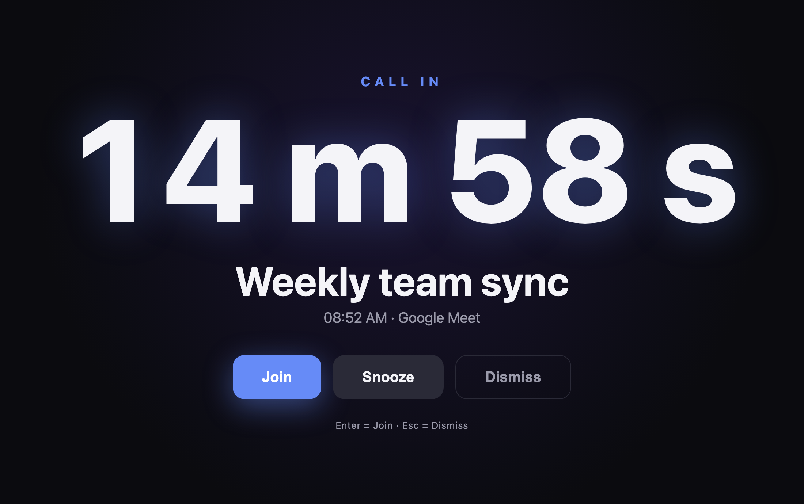
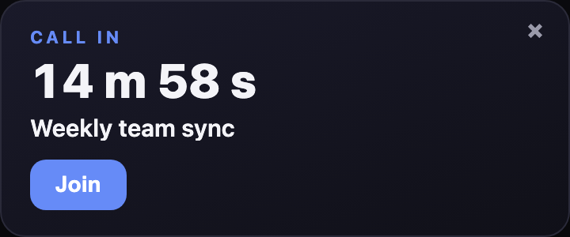
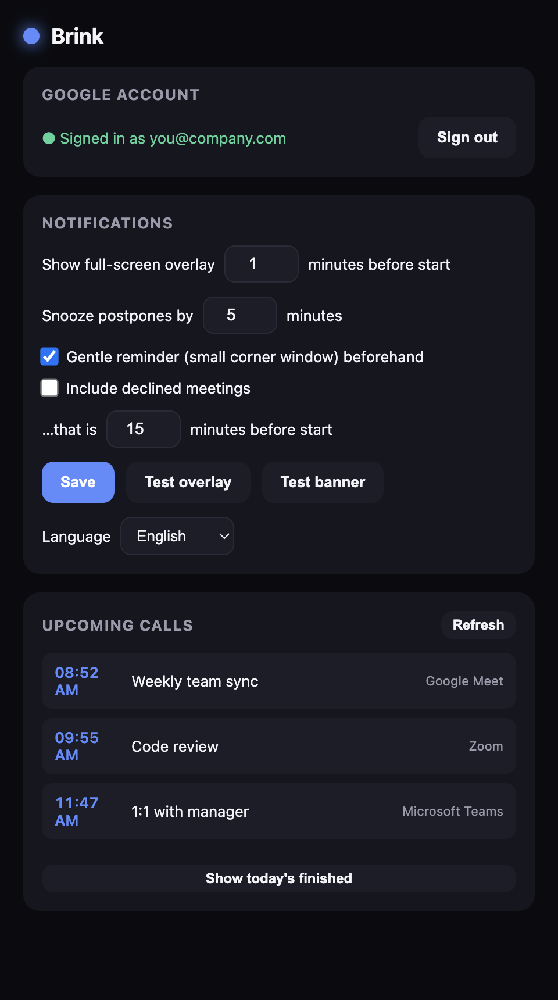
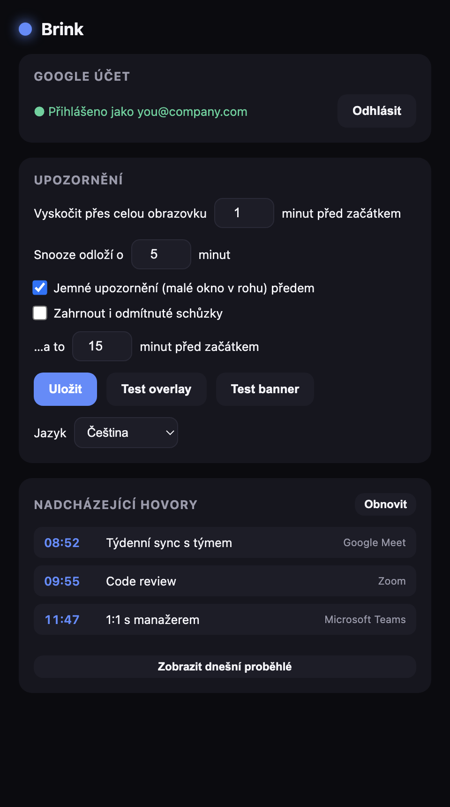

<div align="center">

# 🕙 Brink

**Never miss the start of a video call again.**

Brink watches your Google Calendar and, right before a meeting, throws an
**unmissable full‑screen reminder** on top of everything — even other apps'
full‑screen presentations — with one‑click **Join**. A gentler corner banner
warns you earlier, and a live countdown sits in your menu bar.

Open source · macOS · Windows · Linux · Electron + React + TypeScript ·
connect **your own** Google account.


</div>

---

## Screenshots

| Full‑screen reminder                    | Gentle banner                         | Settings                                  |
| --------------------------------------- | ------------------------------------- | ----------------------------------------- |
|  |  |  |

The UI is bilingual and follows your system language (English / Czech):

| 🇬🇧 English                                   | 🇨🇿 Čeština                                      |
| -------------------------------------------- | ----------------------------------------------- |
|  |  |

---

## Features

- 🔔 **Full‑screen "brink" reminder** moments before a call — covers even other
  apps' native full‑screen spaces.
- 🪧 **Gentle banner** — a small, non‑intrusive corner window earlier on that
  never steals focus. Optional and configurable.
- ⏱ **Live menu‑bar status** _(macOS)_ — countdown to the next call, and how
  much time is **left of the one in progress**.
- ▶️ **Join straight from the tray menu** — even when no window is showing.
- 📅 **Google Calendar** — detects calls with a video link
  (Google Meet / Zoom / Microsoft Teams / Webex / Whereby); skips all‑day and
  declined events (declined are opt‑in).
- 🗓️ **7‑day look‑ahead** with an on‑demand view of today's finished calls.
- 🌐 **Bilingual UI** (English / Czech) — follows your system locale, or pick a
  language manually in Settings.
- 🔐 **Private & hardened by design** — your own OAuth client, read‑only scope,
  token in the OS keychain, sandboxed windows, hardened Electron fuses, a tiny
  dependency tree. See [Privacy & security](#privacy--security).

---

## How it works

Brink is **bring‑your‑own‑account**: you create a free Google OAuth client (5
minutes, [step‑by‑step below](#google-sign-in-setup)), point Brink at it, and
sign in. Your calendar data flows only between **your machine** and **Google** —
there is no Brink server, no middleman, nothing to trust but the source you can
read here.

---

## Requirements

- **Node.js 20+** and npm.
- A Google account with the **Google Calendar API** enabled (free).

---

## Run / build it yourself

There are no prebuilt downloads on purpose — you run code you can audit, with
**your own** Google credentials. Clone and:

```bash
git clone https://github.com/lumitor2/brink.git
cd brink
npm install
```

**Run it (development):**

```bash
npm run dev
```

**Build a real app for your OS** (output in `dist/`):

```bash
npm run dist:mac     # macOS  → .dmg + .zip (arm64 + x64)
npm run dist:win     # Windows → .exe (NSIS installer)
npm run dist:linux   # Linux  → .AppImage
```

> Builds are unsigned (no paid developer certificate). On first launch macOS
> shows _Privacy & Security → "Open Anyway"_; Windows SmartScreen shows
> _More info → Run anyway_. That's expected for a self‑built open‑source app.
> The macOS menu‑bar countdown text is macOS‑only; elsewhere it lives in the
> tray tooltip and menu.

You can either enter your OAuth **Client ID / Secret** in Brink's Settings, or
bake them into the build via a `.env` (see below) so signing in is one click.

---

## Google sign‑in setup

You need your own OAuth **Desktop app** client. It's free and takes a few
minutes. For a Google **Desktop** client the secret is _not_ treated as
confidential — security comes from the loopback redirect + PKCE — so it's safe
to use in a locally‑built desktop app.

1. **Create / pick a project** — [Google Cloud Console](https://console.cloud.google.com/)
   → top project dropdown → _New Project_ (or reuse one).
2. **Enable the Calendar API** — _APIs & Services → Library_ → search
   "Google Calendar API" → **Enable**.
3. **Configure the OAuth consent screen** — _APIs & Services → OAuth consent
   screen_:
   - **User type:** **Internal** if your account is part of a Google Workspace
     organization (recommended — no verification, no token expiry, works for
     everyone in your org). Otherwise **External**.
   - Fill in app name + your email; **Save**.
   - **Scopes:** add `.../auth/calendar.readonly` (read‑only calendar).
   - _External only:_ add yourself under **Test users**. (Until Google verifies
     an External app it shows an "unverified" warning and refresh tokens expire
     after 7 days. Internal apps have neither limitation.)
4. **Create the OAuth client** — _APIs & Services → Credentials → Create
   credentials → OAuth client ID_ → **Application type: Desktop app** → **Create**.
   Copy the **Client ID** and **Client secret**.
5. **Give them to Brink** — either:
   - **In the app:** open Settings, paste Client ID + Secret, click
     _Sign in with Google_; **or**
   - **At build time:** copy `.env.example` to `.env`, fill in
     `GOOGLE_CLIENT_ID` / `GOOGLE_CLIENT_SECRET`, then `npm run dev` / `npm run dist:*`.
     `.env` is gitignored and the values are compiled into your local build, so
     signing in becomes a single click. Nothing secret is ever committed.

That's it — click **Sign in with Google**, approve in the browser, and your
calendar is connected.

---

## Usage

### Tray / menu‑bar icon 🕙

Click the clock icon for the menu:

- **In progress: … · N left** / **Next: … (HH:MM)** — what's running now or
  what's coming up next (and if a call is running, the following one too).
- **Join meeting** — opens the join link of the current/next call in your
  browser. Handy when no window pops up.
- **Sign in / Signed in: …**, **Sync now**, **Settings…**, **Quit**.

On macOS the icon also shows a live status: `in 15 m · Title` before a call, or
`23 m left · Title` during one.

### Full‑screen reminder

**Join** _(Enter)_ opens the call · **Snooze** postpones it · **Dismiss** _(Esc)_
closes it for this meeting.

### Gentle banner

A small window in the top‑right. **Join** opens the call (and suppresses the
later full‑screen reminder); **×** dismisses it (the full‑screen reminder still
fires as a backstop). You can drag it out of the way.

### Settings

Open **Settings…** from the tray menu to set how many minutes ahead each
reminder fires, the snooze length, whether to include declined meetings, and the
**interface language** (Automatic / English / Čeština).

---

## Development

```bash
npm run dev          # run with hot reload
npm run check        # format check + lint + typecheck + tests (run before PRs)
npm run lint         # ESLint
npm run format       # Prettier (write)
npm run typecheck    # tsc, no emit
npm test             # Vitest unit tests
npm run build        # production build into out/
```

CI (`.github/workflows/ci.yml`) runs the same `check` plus `npm audit` on every
push and PR. GitHub Actions are pinned to commit SHAs.

---

## Architecture

| File                    | Role                                                                  |
| ----------------------- | --------------------------------------------------------------------- |
| `src/main/index.ts`     | App lifecycle, tray, IPC, windows, menu‑bar status, launch‑at‑login   |
| `src/main/auth.ts`      | Google OAuth desktop **loopback + PKCE** flow, refresh token          |
| `src/main/store.ts`     | Config + token (encrypted via `safeStorage`) + userData migration     |
| `src/main/calendar.ts`  | Fetches events via the Calendar REST API (no heavy SDK)               |
| `src/main/links.ts`     | Video‑link detection (Meet/Zoom/Teams/Webex/Whereby) — _pure, tested_ |
| `src/main/scheduler.ts` | Sync + 1‑s tick; decides overlay vs. banner; current/next meeting     |
| `src/main/overlay.ts`   | Full‑screen takeover window on every display                          |
| `src/main/banner.ts`    | Small floating gentle‑reminder window                                 |
| `src/main/security.ts`  | Window / navigation / permission hardening                            |
| `src/shared/format.ts`  | Unit‑based countdown formatting — _shared, tested_                    |
| `src/shared/i18n.ts`    | Tiny EN/CS dictionary — _shared, tested_                              |
| `src/renderer/src/*`    | `Settings` / `Overlay` / `Banner` React views                         |

---

## Privacy & security

- **No third‑party servers.** Brink only talks to Google's API, directly from
  your machine, with **your** OAuth client. No telemetry.
- **Token in the keychain.** The Google refresh token is encrypted via the OS
  keychain (`safeStorage`), never stored in plaintext. An invalid/expired token
  auto‑signs‑out and prompts a fresh login.
- **Read‑only.** Requests only the `calendar.readonly` scope.
- **Hardened windows:** `contextIsolation: true`, `sandbox: true`,
  `nodeIntegration: false`, a strict **Content‑Security‑Policy** (`default-src 'self'`),
  blocked in‑app navigation, and **all permission requests denied**. Links open
  in your system browser, never inside the app.
- **Electron fuses** flipped on packaged builds: `RunAsNode` off, cookie
  encryption on, `NODE_OPTIONS`/inspect ignored, **only load app from ASAR**, and
  **ASAR integrity validation** to detect tampering.
- **Small supply chain.** One runtime dependency (`google-auth-library`); the
  Calendar API is called over plain REST. `package-lock.json` is committed;
  `npm ci` + `npm audit` run in CI; GitHub Actions are pinned to commit SHAs.

---

## License

[GPL‑3.0‑or‑later](LICENSE) © Lubomir Jirista

Contributions welcome — open an [issue](https://github.com/lumitor2/brink/issues)
or a pull request. Run `npm run check` before submitting.
